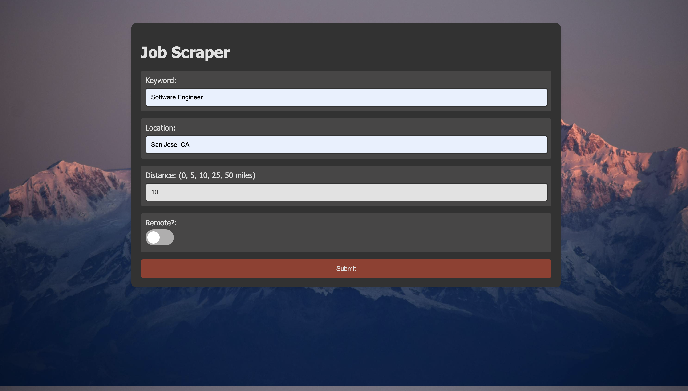
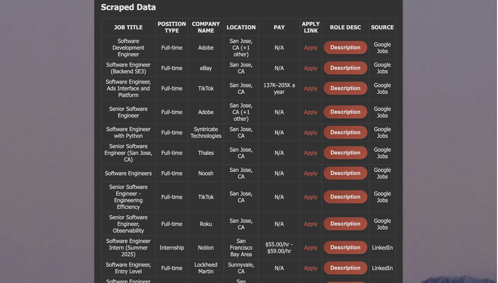
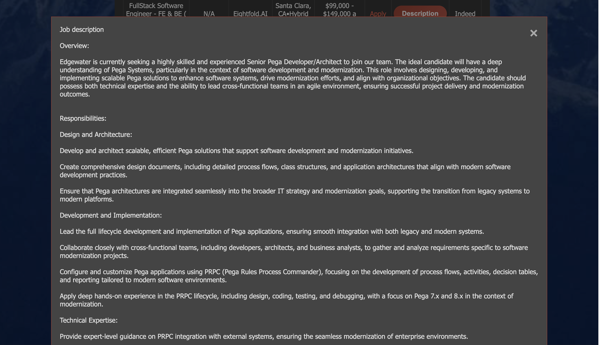

# Job_Scraping

This repository hosts a Flask-based web application designed to scrape job listings from multiple sources including LinkedIn and Indeed. The application allows users to specify job search criteria such as keywords, location, and distance, and optionally filter for remote positions.

## Features

- Web interface for entering job search parameters.
- Scrapes job listings from LinkedIn, Google Jobs, and Indeed.
- Displays scraped data in a user-friendly web format with clickable links and expandable descriptions.

## Getting Started

### Prerequisites

- Python 3.x
- Flask
- Pandas
- Playwright

Install all required packages using pip:

```bash
pip install Flask pandas playwright
```

## Usage
Run the application using:

```bash
python app.py
```

Access the web interface by navigating to http://localhost:5000/ in your web browser.

## File Descriptions

### `app.py`

The main Flask application file. It initializes the Flask app and handles routing for the web interface. It integrates scraping functions that fetch and display job data based on user inputs through forms. It uses Playwright in a headless Chromium browser to scrape job data from LinkedIn and Indeed.

### `index.html`

This HTML template serves as the front-end of the application. It provides a form where users can enter job search criteria such as keyword, location, distance, and remote work preference. The results are presented in a table format with links to apply directly and buttons to view job descriptions in pop-up windows.

### `scraper.py`

Contains the scraping logic using Playwright. This script includes functions to scrape job listings from specific platforms:
- `scrape_linkedin`: Scrapes jobs from LinkedIn based on provided keywords, location, and filters.
- `scrape_indeed`: Fetches job postings from Indeed with similar filtering options.
- `google_jobs_api`: A function that uses Google's Job API to expand the scraping sources.
- `scrape_zip_recruiter`: Scrapes job postings from Zip Recruiter.

## Website Screenshots
### Input Form:


### Scraped Job Posts Output Table:


### Job Description Box:


